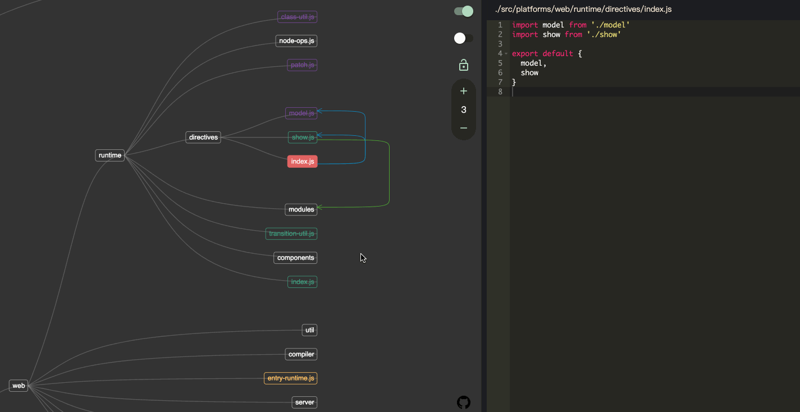

# CodeRoad

<p align="center"></p>

<p align="center">
<a href="https://tools.waningflow.com/npm-download?packageName=coderoad"></a>
<a href="https://www.npmjs.com/package/coderoad"></a>
  <a href="https://www.npmjs.com/package/coderoad"></a>
  <a href="https://travis-ci.com/waningflow/CodeRoad"></a>
  


</p>
<p align="center">
  <a href="https://www.producthunt.com/posts/coderoad?utm_source=badge-featured&utm_medium=badge&utm_souce=badge-coderoad" target="_blank"></a>
</p>

[中文](./readme_cn.md) | English

## Background

> When you want to read the source code of Vue or other excellent open source projects, or when you have just joined a team and have to familiarize yourself with the complex project codebase as soon as possible, you must feel very headache. Because one of the files (modules) always depends on other files (dependencies), or is depended by other files(dependents), a huge network is formed between the modules, which makes people very confused. CodeRoad visualizes the dependence relationship based on dependency analysis, giving you a clearer and more intuitive understanding of the structure of the codebase. Just like seeing "coderoad -- the road of code",

## Preview

Click here to see [_live demo_](https://coderoad.waningflow.com/)


## Description

- The whole interface is divided into left and right parts. On the left it's a tree graph generated according to the project directory structure, and each leaf is forced to align. Dependencies are represented by arrows between the leaves. On the right it's the content of the selected file, which is readable only.
- Each file has four possible states, represented by four colors.
  - Orange: Has `dependencies`. No `dependents`. Usually the entry file of the project.
  - Green: Has `dependencies`. Has `dependents`. Most files will be this state.
  - Purple: No `dependencies`. Has `dependents`. Usually the utils.
  - White: No `dependencies`. No `dependents`. Usually some configuration files or others. All folders are white.
- There are four control options, the functions are:
  - Toggle the editor.
  - Toggle the dependence type. `show dependencies` or `show dependents`
  - Lock starter file. If unlocked, clicking on a file switches to dependence graph starting with that file. If locked, when clicking on other files, the dependence graph will not be switched, only the contents of the editor will be switched.
  - Adjusting Dependence Depth.
- Currently supported file types: `.js`,`.jsx`,`.ts`,`.tsx`,`.vue`

## Installation

```
npm install -g coderoad
```

or with yarn

```
yarn global add coderoad
```

## Usage

Just run the command in the project directory.

```
cd <dir>
coderoad
```

You can also specify the project path manually.

```
coderoad -d <dir>
```

Exclude some directories.

```
coderoad -x <ecludeDir1>,<exlcudeDir2>
```

Specify the alias config path.

```
coderoad -a <path-to-alias-config>
```

Take Vue project as an example. (It comes with alias configuration located in `./scripts/alias.js`)

```
cd <path-to-vue>
coderoad -d src -a scripts/alias.js
```

## Cli

| Parameter        | Description                                                                                                                                     |
| ---------------- | ----------------------------------------------------------------------------------------------------------------------------------------------- |
| `-d`,`--dir`     | Specify the project path                                                                                                                        |
| `-x`,`--exclude` | Exclude some directory and file. The following patterns are excluded by default: node_modules, \_\_tests\_\_, dist and items begining with `.`. |
| `-a`,`--alias`   | Specify the alias config path.                                                                                                                  |
| `-p`,`--port`    | Specify the server port，Default`3450`                                                                                                          |

Example of alias config.

```js
const path = require('path')

module.exports = {
  vue: path.resolve(__dirname, 'src/platforms/web/entry-runtime-with-compiler')
}
```
