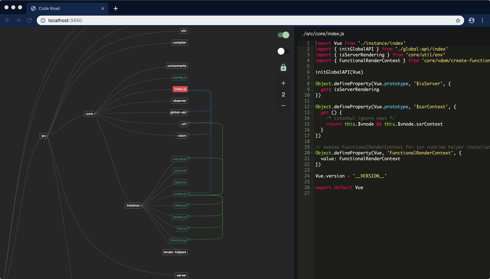

# CodeRoad

<p align="center"></p>

中文 | [English](./readme.md)

## 背景

> 当你想要阅读 vue 或者其他优秀开源项目的源码，或者当你刚加入一个项目组需要尽快熟悉庞杂的项目代码，一定都感到非常头疼。因为其中的一个文件（模块），总是依赖于其他文件（dependencies），或者被其他文件依赖（dependents），各个模块之间形成一张巨大的网，使人非常混乱。CodeRoad 基于依赖分析将这种依赖关系可视化，让你对代码的结构有更清晰直观的认识，就像看到“coderoad -- 代码之路”。

## 预览

点这里查看实际效果[_live demo_](https://coderoad.waningflow.com/)


## 描述

- 界面整体分为左右两部分。左边是根据项目目录结构生成的树状图，并且强制将每个叶对齐，依赖关系通过叶与叶之间的箭头表示。右边是选中文件的内容，只可读。
- 每个文件可能的状态有四种，分别用四种颜色代替。
  - 橙色：有`依赖`, 无`被依赖`，一般会是项目的入口文件，阅读源码时最好从这样的文件开始
  - 绿色：有`依赖`, 有`被依赖`，大部分文件都会是这种
  - 紫色：无`依赖`, 有`被依赖`，一般是通用的工具模块
  - 白色：无`依赖`, 无`被依赖`，一般是某些配置文件或者其他，另外所有文件夹都是显示白色
- 有四个控制选项，功能分别是：
  - 控制编辑器显示与隐藏。
  - 控制显示的依赖类型。置为`dependencies`则箭头指向自身依赖的文件；置为`dependents`则箭头指向依赖自身的文件。默认是`dependencies`。
  - 锁定入口文件。未锁定状态下，点击一个文件会切换到以该文件为起始节点的依赖关系；锁定状态下，点击其他文件，显示的依赖关系不会切换，只会切换编辑器的内容。
  - 调整依赖深度。如`1`表示只显示起始节点所`直接依赖的文件`，`2`表示深入一层，还会显示`直接依赖的文件`所依赖的文件。
- 目前支持的文件类型: `.js`,`.jsx`,`.ts`,`.tsx`,`.vue`

## 安装

```
npm install -g coderoad
```

或者使用 yarn

```
yarn global add coderoad
```

## 用法

进入项目根目录，然后执行命令即可

```
cd <dir>
coderoad
```

当然也可以手动指定项目路径

```
coderoad -d <dir>
```

可以排除若干目录

```
coderoad -x <ecludeDir1>,<exlcudeDir2>
```

可以指定 alias 配置文件

```
coderoad -a <path-to-alias-config>
```

以 vue 项目为例（vue 自带了 alias 配置，位于`./scripts/alias.js`）

```
cd <path-to-vue>
coderoad -d src -a scripts/alias.js
```

## 参数

| 参数             | 描述                                                                               |
| ---------------- | ---------------------------------------------------------------------------------- |
| `-d`,`--dir`     | 指定项目路径                                                                       |
| `-x`,`--exclude` | 排除若干路径和文件, 默认排除了 node_modules, \_\_tests\_\_, dist 以及`.`开头的文件 |
| `-a`,`--alias`   | 指定 alias 配置文件, 格式参考下方示例                                              |
| `-p`,`--port`    | 指定服务器端口，默认是`3450`                                                       |

alias 配置文件示例

```js
const path = require('path')

module.exports = {
  vue: path.resolve(__dirname, 'src/platforms/web/entry-runtime-with-compiler')
}
```
